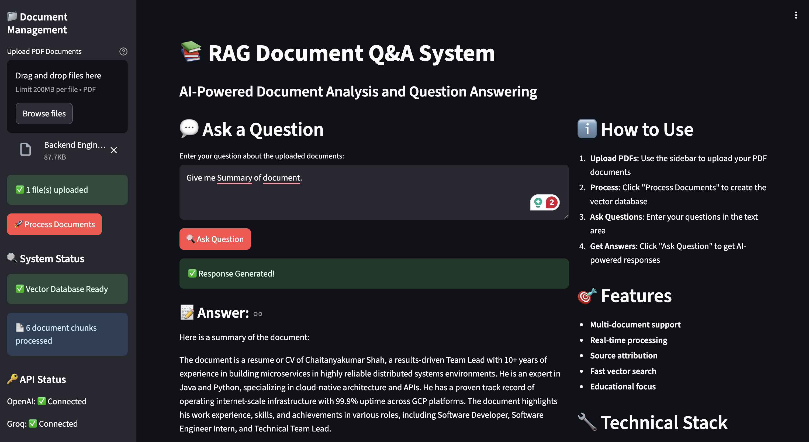

# RAG Document Q&A System

A powerful Retrieval-Augmented Generation (RAG) system built with Streamlit that allows users to upload PDF documents and ask questions about their content using AI.

## Features

- **Multi-document PDF support**: Upload multiple PDF files simultaneously
- **AI-powered Q&A**: Ask questions about your documents and get accurate answers
- **Source attribution**: See which parts of your documents were used to generate answers
- **Real-time processing**: Fast document processing and question answering
- **Educational focus**: Specialized for coding and technology learning
- **User-friendly interface**: Clean, intuitive Streamlit web interface

## Technology Stack

- **Framework**: Streamlit
- **LLM**: Groq (Llama3-8b-8192)
- **Embeddings**: OpenAI
- **Vector Store**: FAISS
- **Document Processing**: LangChain
- **PDF Processing**: PyPDF

## Prerequisites

- Python 3.8+
- OpenAI API key
- Groq API key

## Local Development Setup

1. **Clone the repository**
   ```bash
   git clone <your-repo-url>
   cd rag-document-qa
   ```

2. **Create virtual environment**
   ```bash
   python -m venv venv
   source venv/bin/activate  # On Windows: venv\Scripts\activate
   ```

3. **Install dependencies**
   ```bash
   pip install -r requirements.txt
   ```

4. **Set up environment variables**
   ```bash
   cp .env.example .env
   # Edit .env and add your API keys
   ```

5. **Run the application**
   ```bash
   streamlit run app.py
   ```

## Deployment on Render

### Step 1: Prepare Your Repository

1. **Create a new GitHub repository** and push your code:
   ```bash
   git init
   git add .
   git commit -m "Initial commit"
   git remote add origin <your-github-repo-url>
   git push -u origin main
   ```

### Step 2: Deploy on Render

1. **Sign up/Login to Render**
   - Go to [render.com](https://render.com)
   - Sign up or log in with your GitHub account

2. **Create a new Web Service**
   - Click "New +" → "Web Service"
   - Connect your GitHub repository
   - Select your RAG Document Q&A repository

3. **Configure the service**
   - **Name**: `rag-document-qa` (or your preferred name)
   - **Environment**: Python 3
   - **Build Command**: `pip install -r requirements.txt`
   - **Start Command**: `streamlit run app.py --server.port $PORT --server.address 0.0.0.0 --server.headless true --server.enableCORS false --server.enableXsrfProtection false`

4. **Set Environment Variables**
   - In the Render dashboard, go to "Environment"
   - Add these environment variables:
     - `OPENAI_API_KEY`: Your OpenAI API key
     - `GROQ_API_KEY`: Your Groq API key

5. **Deploy**
   - Click "Create Web Service"
   - Render will automatically build and deploy your application

### Step 3: Configure Persistent Storage (Optional)

For persistent file storage across deployments:

1. **Create a Disk**
   - In Render dashboard, go to "Disks"
   - Create a new disk (1GB recommended)
   - Name it `rag-storage`

2. **Attach to Service**
   - In your web service settings, go to "Disks"
   - Attach the disk to mount path `/opt/render/project/src/research_papers`

## Usage Instructions

1. **Access the application**
   - Open your deployed Render URL
   - Or run locally at `http://localhost:8501`

2. **Upload documents**
   - Use the sidebar to upload PDF files
   - Click "Process Documents" to create the vector database

3. **Ask questions**
   - Enter your questions in the main text area
   - Click "Ask Question" to get AI-powered responses

4. **View results**
   - Read the AI-generated answer
   - Expand "Source Documents" to see supporting text

## API Keys Setup

### OpenAI API Key
1. Go to [OpenAI API Keys](https://platform.openai.com/api-keys)
2. Create a new secret key
3. Copy and use in your environment variables

### Groq API Key
1. Go to [Groq Console](https://console.groq.com)
2. Create an account and get your API key
3. Copy and use in your environment variables

## Troubleshooting

### Common Issues

1. **"Vector database not initialized"**
   - Make sure you've uploaded PDF files
   - Click "Process Documents" after uploading

2. **API key errors**
   - Verify your API keys are correctly set
   - Check that keys have proper permissions

3. **Memory issues**
   - The app limits to 50 documents to prevent memory issues
   - For large documents, consider splitting them

4. **Deployment issues**
   - Check Render logs for specific errors
   - Verify all environment variables are set

### Performance Tips

- Upload smaller PDF files for faster processing
- Use clear, specific questions for better results
- The system works best with technical/educational content

## Contributing

1. Fork the repository
2. Create a feature branch
3. Make your changes
4. Submit a pull request

## Running Application



## License

This project is open source and available under the [MIT License](LICENSE).

## Support

For issues or questions:
- Create an issue on GitHub
- Check the troubleshooting section above
- Review Render deployment logs

---

**Note**: This application is designed for educational purposes and learning coding/technology concepts. Always ensure you have proper rights to the documents you upload.